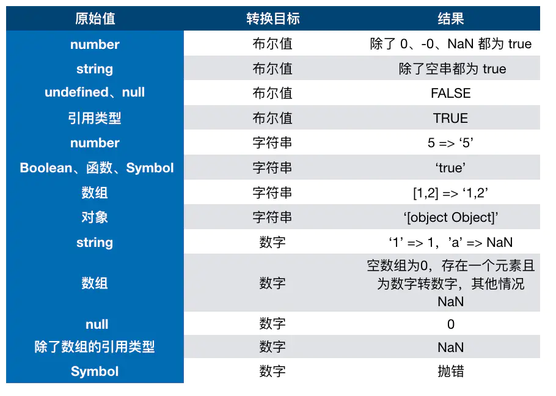

# JS基础知识

### 原始 \(Primitive\) 类型

js有6种原始类型:

* `boolean`
* `null`
* `undefined`
* `number`
* `string`
* `symbol`

原始类型存储的都是值，没有函数可以调用。

### 对象 \(Object\) 类型

除了原始类型其他的都是对象类型。原始类型存的是值，对象类型存的是指针。

```javascript
const a = []
const b = a
b.push(1)
```

结果b和a都会发生改变。

```javascript
function test(person) {
    person.age = 26
    person = {
        name: 'yyy',
        age:30
    }
    return person
}

const p1 = {
    name: 'zzz',
    age: 25
}

const p2 = test(p1)
console.log(p1.age) //26
console.log(p2.age) //30
```

函数传参是传递对象指针的拷贝。

### typeof vs instanceof

`typeof` 对于原始类型来说，除了 `null` 都可以显示正确的类型。

`typeof` 对于对象类型来说，除了 `function` 都会显示 `object`

`instanceof` 通过原型链实现。原始类型不能用 `instanceof` 判断。

```javascript
const Person = function() {}
const p1 = new Person()
p1 instanceof Person //true

var str = 'hello world'
str instanceof String // false

var str1 = new String('hello world')
str1 instanceof String // true
```


### 类型转换

JS中类型转换只有三种情况：

* 转换为布尔值
* 转换为数字
* 转换为字符串



对象在转换类型的时候回调用 `[[ToPrimitive]]` 函数：

* 如果转换字符串则调用 `x.toString()` ，转换为基础类型的话就返回转换的值。不是字符串的话就先调用 `valueOf` ，结果不是基础类型的话再调用 `toString` 

可以重写 `Symbol.toPrimitive` 

### 四则运算

加法运算中一方为字符串，把另一方也转换为字符串。如果一方不是字符串或者数字，则会将它转换为数字或者字符串。

除加法外，只要其中一方是数字，那么另一方也会被转换为数字。

```javascript
1 + '1' //'11'
true + true //2
4 + [1,2,3] // '41,2,3'
'a' + + 'b'  // 'aNaN'

4 * '3' // 12
4 * [] // 0
4 * [1,2] //NaN
```

### 比较运算符

* 如果为对象，就通过 `toPrimitive` 转换对象
* 如果为字符串，就通过 `unicode` 字符索引来比较

```javascript
let a = {
    valueOf() {
        return 0
    }
}

a > -1 // true
```

比较数字，调用 `valueOf` 转换为原始类型。

### this

指向调用它的对象。

```javascript
function foo() {
    console.log(this.a)
}
var a = 1
foo() // this = window

const obj = {
    a: 2,
    foo: foo
}
obj.foo() //this = obj

const c = new foo() // this = c this被永远绑定在c上，不会被任何方式改变
```

箭头函数 `this` 取决于包裹箭头函数的第一个普通函数的 `this` 。对箭头函数使用 `bind` 是无效的。

```javascript
let a = {}
let fn = function() {console.log(this)}
fn.bind().bind(a)() // window
```

多次 `bind` 取决于第一次 `bind` 。

### 闭包

定义：函数A内部有个函数B，函数B可以访问到函数A中的变量，函数B就是闭包。

```javascript
for(var i=1;i<=5;i++) {
    setTimeout(function timer() {
        console.log(i)
    },i*1000)
}
// 输出一堆6

for(var i=1;i<=5;i++) {
    (function(j) {
        setTimeout(function timer(){
            console.log(j)
        },1000)
    })(i)
}
```

### 深浅拷贝

#### 浅拷贝

只拷贝一层，可以用 `Object.assign` 。如果属性值是个对象拷贝的还是地址。

```javascript
let a = {
    age: 1
}
let b = Object.assign({},a)
a.age = 2
console.log(b.age) //1

//-----------------------//

let b = { ...a }
```

#### 深拷贝

```javascript
let a = {
    age: 1,
    jobs: {
        first: 'FE'
    }
}
let b = JSON.parse(JSON.stringify(a))
a.jobs.first = 'native'
console.log(b.jobs.first)  // 'FE'
```

局限性：

* 会忽略 `undefined` 
* 会忽略 `symbol` 
* 不能序列化函数
* 不能解决循环引用的对象

### 原型

每个对象有个 `__proto__` 属性指向原型，对象的 `constructor` 有 `prototype` 属性也指向原型（函数才有 `prototype`），并不是所有函数都有这个属性， `Function.prototype.bind()` 就没有这个属性。

原型链指的是多个对象通过 `__proto__` 的方式连接起来。

`Function` 和 `Object` 都是构造函数，所以他们的 `__proto__` 都是 `Function.prototype` ，`Function.prototype` 是个对象，所以 `Function.prototype.__proto__ == Object.prototype` 


